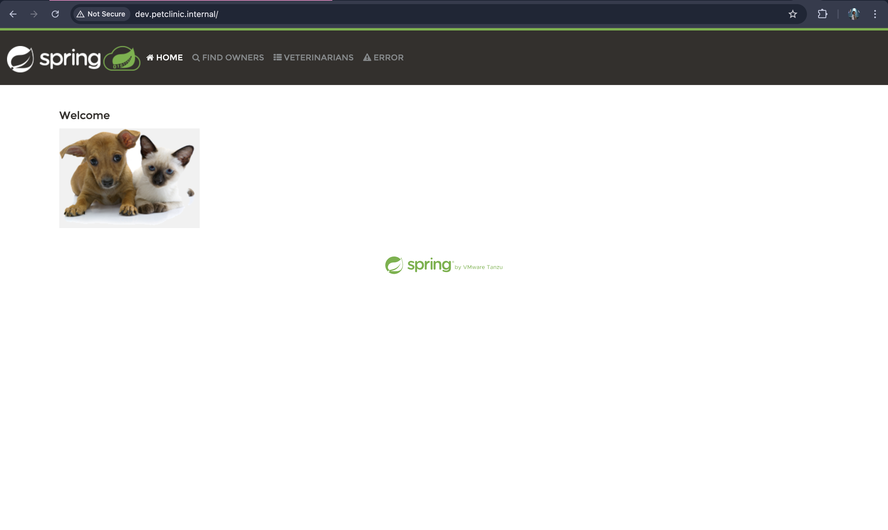
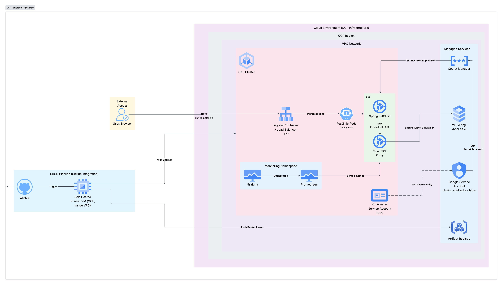
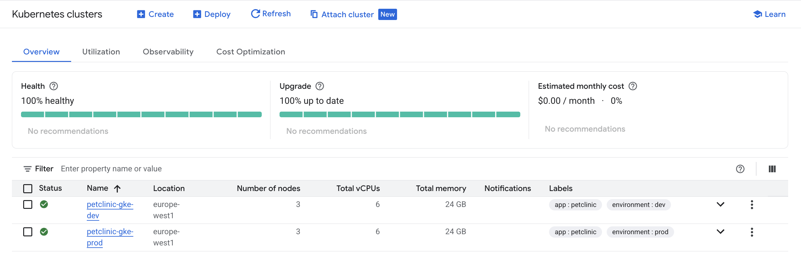

# Advanced Capstone Project: Spring PetClinic Application


This repository serves as the **Application Source Code** component of the DevOps Capstone Project for the GridDynamics Internship.

It contains the Java Spring Boot application (forked from the official Spring PetClinic), along with the containerization configurations, Helm charts, and CI/CD pipelines required to build and deploy the application to Kubernetes.

## Repository Contents

This repository is organized to support the full application lifecycle:

* **Application Code** (`src/`): The core Spring Boot application source code, forked from [spring-projects/spring-petclinic](https://github.com/spring-projects/spring-petclinic).
* **Containerization** (`Dockerfile`): A multi-stage Dockerfile located at the root for building the application image.
* **Kubernetes Deployment** (`chart/petclinic`): A custom Helm chart used to deploy the application to the Kubernetes cluster. It includes templates for Deployments, Services, Ingress, and ConfigMaps.
* **CI/CD Pipelines** (`.github/workflows`): Automated GitHub Actions workflows for continuous integration and delivery.

For more details, please refer to:
* [Capstone Project Description ](.github/assets/Capstone%20advanced%20k8s%20project.pdf)
* [Spring-Petclinic App Repository](https://github.com/njakov/capstone-project-app)

## Project Overview

* **Cloud Provider:** Google Cloud Platform (GCP) 
* **Infrastructure Tool:** Terraform (State stored in GCS with versioning)
* **Orchestrator:** Google Kubernetes Engine (GKE) - Private Cluster
* **Database:** Cloud SQL (MySQL) - Private IP only
* **Secrets Management:** Google Secret Manager
* **CI/CD:** GitHub Actions (Self-hosted runners)
* **Configuration Management:** Helm 
* **Monitoring:** Prometheus & Grafana (via Helm) 

## Project Demo
 

### Production

### Development

---

## Repository Structure

```text
├── .github/workflows/       # CI/CD Pipelines
├── environments/
│   ├── bootstrap/           # Initial setup (VPC, Runner, State Bucket)
│   ├── dev/                 # Development environment entry point
│   └── prod/                # Production environment entry point
├── modules/                 # Reusable Terraform modules
│   ├── artifact-registry/   # Docker container storage
│   ├── cloud-sql/           # Managed MySQL database
│   ├── gke/                 # Kubernetes Cluster configuration
│   ├── identity/            # Service Accounts & Workload Identity
│   ├── middleware/          # Helm charts (Ingress, Prometheus)
│   ├── network/             # VPC, Subnets, Firewalls, NAT
│   └── runner/              # Self-hosted GitHub Action Runner VM
├── scripts/                 # Bash scripts for setup and bootstrapping
└── .tfsec/                  # Security scanner configuration
``` 

## Architecture

The infrastructure follows a modular design with environment separation (`dev`, `prod`) and a bootstrap layer.

### Key Components
1.  **Network (`modules/network`):**
    * Custom VPC with private subnets.
    * **Cloud NAT:** Allows private nodes to access the internet for updates without exposing public IPs.
    * **IAP Tunneling:** SSH access to internal VMs (Runners) is restricted to Identity-Aware Proxy; no public SSH ports are open.
2.  **Compute (`modules/gke` & `modules/runner`):**
    * **GKE:** Private cluster with VPC-native networking. Autoscaling enabled (1-3 nodes) based on CPU usage.
    * **GitHub Runner:** A dedicated VM in the private subnet acting as a self-hosted runner for CI/CD pipelines. It comes pre-installed with Docker, Terraform, Helm, Java 25, and security scanners (TFSec, TFLint).
3.  **Database (`modules/cloud-sql`):**
    * Cloud SQL (MySQL 8.0) connected via Private Service Access (VPC Peering).
    * Passwords are generated randomly and stored immediately in **Google Secret Manager**.
4.  **Security:**
    * **Workload Identity:** GKE Service Accounts map to GCP Service Accounts for fine-grained permissions.
    * **Secret Manager:** Centralized management for DB credentials and URLs.
    * **Least Privilege:** Custom Service Accounts with specific IAM roles for Runners and Nodes.

## Architecture Diagram



## Getting Started

### Prerequisites  

1.  **GCP Project:** You must have a Google Cloud Project ID (e.g., `my-gcp-project`).  
2.  **Google Cloud SDK:** Installed and authenticated locally.  
3.  **Terraform:** Installed (v1.14+).  

### Step 1: Initial GCP Setup  
Run the setup script to enable required APIs (KMS, Storage, IAM), create the Terraform State Bucket, and set up the Service Account with necessary permissions. 
 
```bash  chmod +x scripts/setup_gcp.sh  ./scripts/setup_gcp.sh   ```

*   **What this does:** This script executes create-bucket.sh to provision the GCS backend with versioning and setup-terraform-sa.sh to create the Service Account and assign IAM roles.
    

### Step 2: Bootstrap Environment (Network & Runner)

Before deploying the application infrastructure, you must bootstrap the environment. This layer creates the VPC, Subnets, and the Self-Hosted Runner VM required for the CI/CD pipelines.

```bash  chmod +x scripts/bootstra-env.sh  ./scripts/bootstrap-env.sh <ENV-NAME>  ```

*   **What this does:** This script initializes Terraform in environments/bootstrap and applies the configuration using the corresponding .tfvars file (e.g., dev.tfvars).

*   **Output:** Upon completion, it will output the runner\_ssh\_command needed to access the private runner VM.
    

### Step 3: Configure GitHub Secrets

To allow the pipelines to run successfully, add the following secrets to your GitHub Repository settings:

*   `GCP_PROJECT_ID`: Your Project ID (e.g., my-project-id).
    
*   `GCP_REGION`: The region for resources (e.g., europe-west1).
    
*   `TF_STATE_BUCKET`: The name of the GCS bucket created in Step 1 (e.g., terraform-state-my-project-id).
    

CI/CD Pipelines
------------------

The project utilizes **GitHub Actions** with a self-hosted runner located inside the private VPC. The runner is pre-configured via a startup script to include Docker, Terraform, Helm, and Java.

### Dev Infrastructure Pipeline (dev-only-pipeline.yml)

*   **Trigger:** Pushes to the dev branch or manual workflow\_dispatch.
    
*   **Jobs:**
    
    *   **Validate & Scan:** Runs terraform fmt, terraform validate, tflint, and tfsec to ensure code quality and security.
        
    *   **Plan:** Generates a speculative execution plan.
        
    *   **Apply:** Manual trigger required to apply changes to the Dev environment.
        
    *   **Destroy:** Manual trigger required to tear down resources.
        

### Main Infrastructure Pipeline (infra-pipeline.yml)

*   **Trigger:** Pushes to the main branch.
    
*   **Protection:** Enforces that Production deployments can **only** occur from the main branch. If a prod deployment is attempted from another branch, it exits with an error.
    
*   **Workflow:** Similar to Dev, but targets the prod environment state and workspace.

### Google Cloud Platform 

    
### Deployment Pipelines

This repository utilizes GitHub Actions to automate the software delivery process. The workflows are located in `.github/workflows`:

| Workflow | Trigger | Description |
| :--- | :--- | :--- |
| **PR Release** (`pr-release.yml`) | Pull Request | Runs on every PR. Performs unit tests, static code analysis, and security scanning (Trivy) to ensure code quality before merging. |
| **Main Release** (`main-release.yml`) | Push to `main` | Runs when code is merged to main. bumps the Semantic Version, builds the Docker image, tags it with the new version, and pushes it to the Container Registry (GCR/Artifact Registry). |
| **Manual Deploy** (`manual-deploy.yml`) | Manual Dispatch | A manual workflow to deploy a specific version of the application to the Kubernetes cluster using Helm. |
## Tools & Technologies Used

| Category | Tool | Description |
| :--- | :--- | :--- |
| **IaC** | Terraform | Infrastructure provisioning (v1.14+). |
| **State** | GCS | Remote backend with versioning enabled. |
| **Container** | Docker | Application packaging and registry management. |
| **Orchestration** | Kubernetes (GKE) | Container management with VPC-native networking. |
| **Charts** | Helm | Deploying Nginx Ingress and Prometheus stack. |
| **Security** | TFSec / TFLint | Static analysis for Terraform code. |
| **Secrets** | Secret Manager | Secure storage for Database credentials and URLs. |
| **CI/CD** | GitHub Actions | Automation pipelines running on self-hosted runners. |

Monitoring & Middleware
--------------------------

The modules/middleware module installs essential shared services into the cluster via Helm:

1.  **Nginx Ingress Controller:** Managed via Helm, configured as a LoadBalancer (type: ClusterIP) with restricted source ranges.
    
2.  **Kube Prometheus Stack:** Deploys Prometheus and Grafana into the monitoring namespace for cluster metrics and visualization.

 

Important Notes
------------------

*   **State Management:** The Terraform state is stored remotely in a GCS bucket.
    
*   **Security:** Public access to the database is disabled. The Cloud SQL instance only allows connections via Private Service Access (VPC Peering).
    
*   **SSH Access:** SSH access to the runner is restricted to IAP tunneling; 
    
*   **Cost:** This infrastructure creates real resources (GKE Cluster, Load Balancers, Cloud SQL). Remember to run the **Destroy** workflow.

